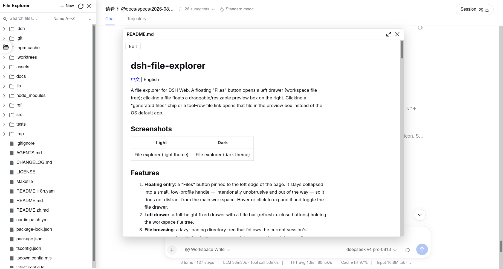
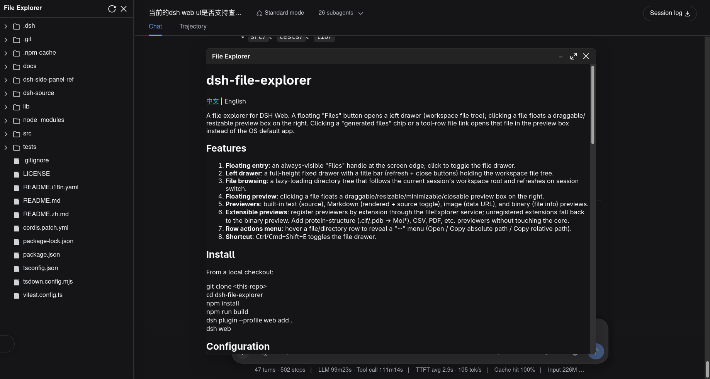

# dsh-file-explorer

[English](README.md) | 中文

DSH Web 的文件浏览器。页面边缘有一个浮动「文件」按钮，点击打开左侧抽屉（工作区文件树），点文件在右侧浮出可拖拽/缩放的预览框。点击会话区"生成的文件"芯片或工具行文件链接，会自动在预览框中打开对应文件，而非跳到系统默认应用。

## 截图

| 浅色 | 深色 |
| ---- | ---- |
|  |  |

## 功能

1. **浮动入口**：页面左侧边缘固定一个「文件」按钮。它默认收起为小巧低调的把手，刻意不引人注目、不干扰主工作区；悬停或点击时展开，即可开关文件浏览器抽屉。
2. **左抽屉**：左侧全高抽屉（fixed），标题栏带刷新 + 关闭按钮，内含工作区文件树。
3. **文件浏览**：懒加载目录树，跟随当前会话的工作区根目录，切换会话时自动刷新。
4. **悬浮预览框**：点文件在右侧浮出可拖拽/缩放/最小化/关闭的预览框。
5. **文件预览**：内置文本（源码）、Markdown（渲染 + 源码切换 + 行内编辑）、图片（data URL）、二进制（hexdump）预览。
6. **可扩展预览**：通过 `fileExplorer` 服务按扩展名注册预览器，未注册的扩展名回退到 `binary` 预览。新增蛋白质结构（`.cif`/`.pdb` → Mol*）、CSV 等预览器无需改动核心。
7. **PDF 新标签页打开**：点击 `.pdf` 文件直接在新浏览器标签页用浏览器原生 PDF 阅读器打开（无需开发 PDF 预览器）。
8. **行操作菜单**：hover 文件/目录行末尾出现「···」菜单（打开 / 复制绝对路径 / 复制相对路径）。
9. **快捷键**：`Ctrl/Cmd+Shift+E` 开关文件浏览器抽屉。

## 安装

从 git 仓库安装（推荐）：

```sh
dsh plugin --profile web add github:wolfsonliu/dsh-file-explorer
dsh web
```

或从本地目录安装：

```sh
git clone https://github.com/wolfsonliu/dsh-file-explorer
cd dsh-file-explorer
npm install
npm run build
dsh plugin --profile web add .
dsh web
```

### 可选预览插件

安装额外的预览器以获得更丰富的文件预览体验：

```sh
# 基于 CodeMirror 6 的代码预览，支持语法高亮与编辑
dsh plugin --profile web add github:wolfsonliu/dsh-file-explorer-preview-code

# 基于 Mol* 的分子结构预览（.cif / .pdb）
dsh plugin --profile web add github:wolfsonliu/dsh-file-explorer-preview-molstar

# 基于 SeqViz 的序列查看器（FASTA / GenBank / JBEI / SnapGene / SBOL）
dsh plugin --profile web add github:wolfsonliu/dsh-file-explorer-preview-sequence
```

## 配置

组合包默认启用以下配置：

```yaml
- insert:
    - id: file-explorer
      name: '@dsh-external/dsh-file-explorer'
      config:
        maxTextBytes: 2097152
        maxImageBytes: 10485760
        maxBinaryBytes: 65536
```

| 配置项           | 默认值 | 说明                                   |
| ---------------- | -----: | -------------------------------------- |
| `maxTextBytes`   |  2 MiB | 可预览的单个文本文件大小上限           |
| `maxImageBytes`  | 10 MiB | 可预览的单个图片大小上限               |
| `maxBinaryBytes` | 64 KiB | 二进制文件 hexdump 读取的字节数上限    |

## 数据层

宿主半部通过 `ctx.webServer.register()` 注册一个 `/file-explorer/api` 精确路由，动作（`action` 查询参数）：

- `list`：列出一级目录（目录在前、按名称排序），返回 `BrowserEntry[]`。
- `preview`：读取单个文件，返回判别式 `FilePreview`（`text` / `image` / `empty` / `binary` / `too-large`）。
- `pdf`：以内联方式流式返回 `.pdf` 文件（`Content-Type: application/pdf`），由浏览器原生阅读器在新标签页渲染。
- `resolve-path`：解析工作区相对路径为绝对路径与父路径。
- `write`：把 UTF-8 文本写入工作区文件（POST body `{ path, content }`），返回保存的相对路径。

所有路径经 `inside(root, input)` 工作区包含校验（含 `realpath` 符号链接解析），越界路径一律拒绝。文本/二进制通过 NUL 字节扫描判别，图片按扩展名映射 MIME 并返回 data URL。二进制预览返回前 `maxBinaryBytes` 字节的 base64（附带 `truncated` 标志），用于 `hexdump -C` 风格的十六进制转储。

## Model Experience

本插件为纯 UI 表面，**不产生任何会话事件、不改动会话日志**，对模型不可见。宿主半部仅读取文件内容用于浏览器预览，与 agent 工具执行互不影响。

## Known Limitations and Deferred Work

- **仅 Markdown 支持编辑**：内置 Markdown 预览支持行内编辑/保存（切换文件或关闭面板时自动保存）；全文件类型的 CodeMirror 文本编辑属于后续阶段。
- **单文件预览**：无多标签页、无行内 diff。
- **不轮询刷新**：目录树仅手动刷新（↻），切换会话时自动刷新。
- **文件链接拦截为 best-effort**：依赖 DSH 会话区的 CSS 类名（`_fileLink`、`data-produced-files-row`），上游 UI 结构调整时需同步选择器。
- **大文件**：文本/图片读取受 `maxTextBytes`/`maxImageBytes` 上限约束，二进制 hexdump 只读取前 `maxBinaryBytes` 字节；流式读取未实现。
- **PDF 不支持分段请求**：`pdf` 动作整体流式返回，不支持 `Range`/`206`，超大 PDF 需完整下载后原生阅读器才能渲染；分段加载留待后续。

## 开发扩展

`dsh-file-explorer` 通过 cordis 服务 `fileExplorer` 暴露注册入口：`registerPreview`、`registerFileAction`、`writeFile` 和 `readRawFile`。领域专家可把扩展做成独立插件（命名 `@dsh-external/dsh-file-explorer-preview-<domain>`），无需改动核心。

完整指南请参阅 **[开发 dsh-file-explorer 扩展](docs/developing-extensions.zh.md)**（[English](docs/developing-extensions.md)）——契约、路由、用 `readRawFile` 处理大文件/二进制、用 `writeFile` 编辑、打包、国际化，以及参考实现。

快速骨架：

```typescript
import type { PreviewProps } from '@dsh-external/dsh-file-explorer/client'

export const inject = ['fileExplorer']

export function apply(ctx: {
  fileExplorer: { registerPreview(ext: string, comp: React.ComponentType<PreviewProps>, priority?: number): () => void }
  effect(cb: () => (() => void), label?: string): void
}): void {
  ctx.effect(() => ctx.fileExplorer.registerPreview('cif', CifPreview, 10))
}
```

## 扩展

`dsh-file-explorer` 通过 `fileExplorer` 服务支持扩展。已有的扩展：

| 扩展 | 说明 | 仓库 |
| ---- | ---- | ---- |
| `dsh-file-explorer-preview-code` | 基于 CodeMirror 6 的代码预览与编辑 | [wolfsonliu/dsh-file-explorer-preview-code](https://github.com/wolfsonliu/dsh-file-explorer-preview-code) |
| `dsh-file-explorer-preview-molstar` | 基于 Mol* 的分子结构预览（`.cif` / `.pdb`） | [wolfsonliu/dsh-file-explorer-preview-molstar](https://github.com/wolfsonliu/dsh-file-explorer-preview-molstar) |
| `dsh-file-explorer-preview-sequence` | 基于 SeqViz 的序列查看器预览（FASTA / GenBank / JBEI / SnapGene / SBOL） | [wolfsonliu/dsh-file-explorer-preview-sequence](https://github.com/wolfsonliu/dsh-file-explorer-preview-sequence) |

欢迎增加更多扩展——参照 [开发扩展](docs/developing-extensions.zh.md) 自行开发即可。

## 开发

```sh
npm install
npm run check     # tsc 类型检查
npm test          # vitest 单元测试
npm run build     # tsc + tsdown（宿主 ESM + 客户端 CJS bundle）
```

## 参考

- [dsh-side-panel](https://github.com/ccq1/dsh-side-panel) — 一个 DSH Web 侧边栏插件，本项目的宿主路由与文件链接拦截借鉴了它的架构。
- [DeepSeek Harness](https://github.com/deepseek-ai/deepseek-harness) — 本插件所扩展的 DSH 框架。

## 许可

[MIT](LICENSE)
